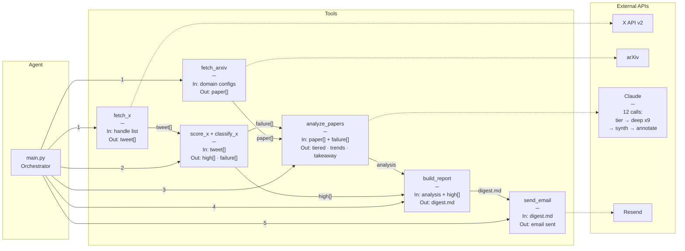

# Agent + Tool Interaction Diagram

Orchestrator invocation sequence, data contracts between tools, and external API boundaries.

Solid arrows = invocation or data handoff.
Dotted arrows = external API calls.
Labels on tool nodes = input/output contract.



## Claude Sub-Orchestration

`analyze_papers` is the only tool with internal state. `run_analysis()` sequences 12 Claude calls — each is a stateless, independent API call with no shared context:

```
run_analysis()
│
├─ Call 1:    tier_assign()          — all papers in one prompt → JSON {arxiv_id: tier}
│
├─ Calls 2–10: deep_analyze()      — one paper per call, tier-specific template
│             Tier 1 template: core idea · technique · why it changes the game · cross-domain take · caveats
│             Tier 2 template: problem+solution · results · tools released · cross-domain take · adoption barriers
│             Tier 3 template: key insight · real-world tradeoff · how to use it · performance gains
│
├─ Call 11:  synthesize_trends()    — all deep analyses in → trends markdown + takeaway (extracted via marker)
│
└─ Call 12:  annotate_failure_signals() — all failure tweets in one prompt → JSON {index: why_it_matters}
```

Two calls return structured JSON (`tier_assign`, `annotate_failure_signals`). Two return free-form markdown (`deep_analyze`, `synthesize_trends`). All prompts frame output for a Pricing PM audience.
