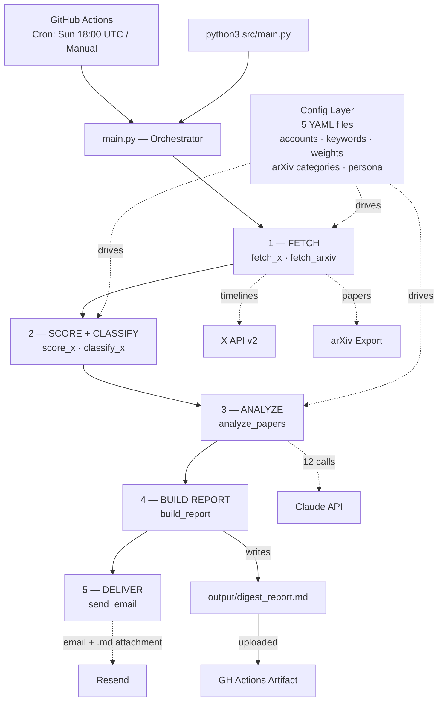

# Architecture Diagram

System-level view. Entry points, pipeline stages, external services, config layer, output artifacts.

Solid arrows = runtime data / control flow.
Dotted arrows = config reads or external API calls.

